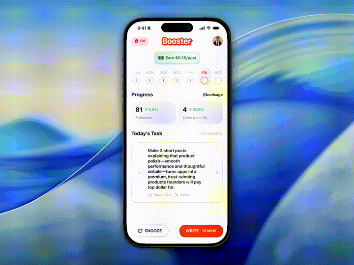

# UnionScreenshots

A SwiftUI package for controlling view visibility during screen capture and displaying content behind the Dynamic Island.



## Features

- **Screenshot Mode**: Control how views appear in screenshots and screen recordings
- **Dynamic Island Background**: Display content behind the Dynamic Island or notch
- Automatic device type detection
- Pass-through touch handling

## Requirements

- iOS 18.0+
- Swift 6.2+

## Installation

Add the package to your Xcode project:

```swift
dependencies: [
    .package(url: "https://github.com/unionst/union-screenshots.git", from: "1.0.0")
]
```

## Screenshot Mode

Control how views appear during screen capture using the `.screenshotMode()` modifier.

### Secure (Hidden in Screenshots)

Hide sensitive content from screenshots and screen recordings:

```swift
Text("Secret Code: 1234")
    .screenshotMode(.secure)
```

### Watermark (Visible Only in Screenshots)

Show content only when a screenshot is taken:

```swift
Text("CONFIDENTIAL")
    .screenshotMode(.watermark)
```

The background color is automatically sampled from the pixels behind the view. For explicit control, you can specify any `ShapeStyle`:

```swift
Text("CONFIDENTIAL")
    .screenshotMode(.watermark(background: .white))  // color

Text("CONFIDENTIAL")
    .screenshotMode(.watermark(background: .regularMaterial))  // material
```

### Visible (Normal Behavior)

Use `.visible` for conditional logic:

```swift
Text("Hello")
    .screenshotMode(isProtected ? .secure : .visible)
```

### API

```swift
enum ScreenshotMode {
    case visible                              // Normal behavior
    case secure                               // Hidden in screenshots
    case watermark                            // Visible only in screenshots (auto background)
    static func watermark(background: some ShapeStyle)  // Explicit background
}

func screenshotMode(_ mode: ScreenshotMode) -> some View
```

## Dynamic Island Background

Display content behind the Dynamic Island or notch.

### Basic Usage

```swift
ContentView()
    .dynamicIslandBackground {
        Image(.logo)
            .resizable()
            .scaledToFit()
    }
```

### Conditional Visibility

```swift
NavigationStack(path: $path) {
    // ...
}
.dynamicIslandBackground(!path.isEmpty) {
    Text("Recording")
        .font(.caption)
        .foregroundStyle(.red)
}
```

### Custom Alignment

```swift
.dynamicIslandBackground(alignment: .leading) {
    HStack {
        Circle()
            .fill(.red)
            .frame(width: 8, height: 8)
        Text("Live")
            .font(.caption2)
    }
}
```

### API

```swift
func dynamicIslandBackground<Content: View>(
    _ isVisible: Bool = true,
    alignment: HorizontalAlignment = .center,
    @ViewBuilder content: @escaping () -> Content
) -> some View
```

## How It Works

**Screenshot Mode** leverages the same mechanism iOS uses for `SecureField` to hide content from screen capture. Content inside a secure container is visible during normal use but hidden in screenshots, recordings, and screen mirroring.

**Dynamic Island Background** creates a separate `UIWindow` overlay at a high window level that persists across navigation and appears behind the Dynamic Island cutout.

## License

MIT
